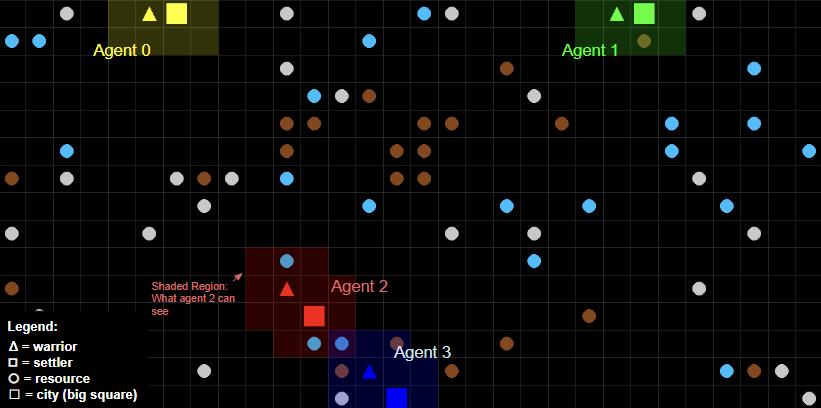
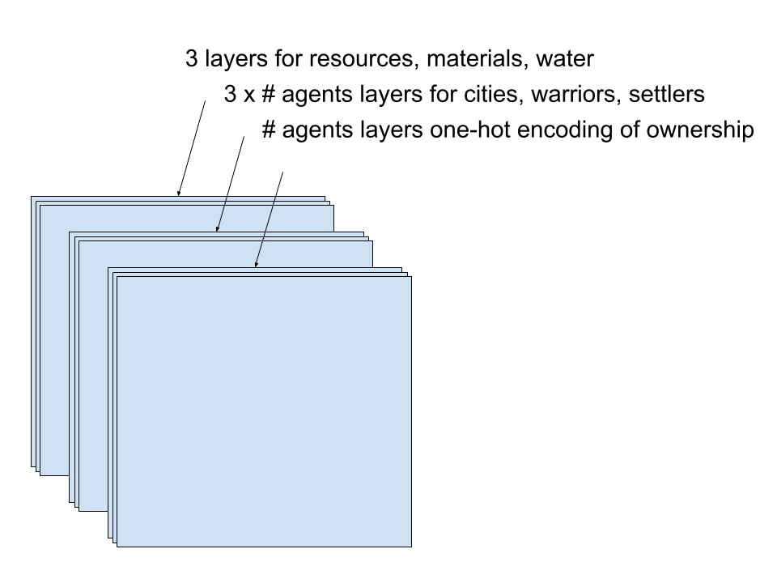

# Eco Civilization MDP: A Multi-Agent Environment for Studying Sustainable Growth

## Introduction



This repository is a modified implementation of the game Civilization, with the aim of studying the effects of different development options with differing impacts on the environment on the growth of countries in a competitive environment. The environment is implemented in [Petting Zoo](https://pettingzoo.farama.org/), which itself is based on [Gymnasium](https://gymnasium.farama.org/), both of which are industry standards, for compatibility. The repository includes an implementation of [MAPPO](https://arxiv.org/abs/2103.01955), which we believed would be a good learning algorithm for this environment. It was created as a final project for COMPSCI/STAT 184 - Reinforcement Learning at Harvard College by Ege Cakar, Zoe Wu and Anne Mykland. 

## Usage

To utilize the code in the repository, clone it via 

```bash
git clone https://github.com/Ege-Cakar/Eco-Civilization-MDP.git
```

then `cd` into it: 

```bash
cd Eco-Civilization-MDP
```

First, install the requirements via `pip install -r requirements.txt`, preferably in a virtual environment. You will see the environment under the `env` folder, defined inside the `civ.py` file, and you will find the RNNs and the agents defined inside the `agents` folder. To use the environment, import the `Civilization` class, which is a Petting Zoo `AECEnv`,  in your implementation of learning agents. To use our implementation of MAPPO, run: 

```bash
python3 agents/test.py
```

Starting training with the hyperparameters defined inside `test.py`, which can be changed. 

## Civilization Environment Specifics

Here are some basic specifics for the Civilization environment for utilization with your own algorithms. More detailed information can be found in the final paper described below. Example usage can be found in `test.py`. 

`num_agents` number of agents compete in a grid of size `map_size`, both of which are provided to the Civilization class upon initialization. `num_agents` expects an `int` with a maximum size of 6, while `map_size` expects a tuple with no defined maximum size. However, we don't recommend going too large, since the observations received by the models will be dependent on this, which in turn will affect RAM usage. The specifics of the state dictionary can be found in the final paper in the Github repository, but essentially, we have a dictionary per agent with the keys `map`, `units`, `cities` and `money`. 

`map` is a 3D one-hot encoded tensor, represented as a `spaces.Box`, where the first two axes are used to represent a tile, and on the third axis we represent whether there's a resource there (3 values are reserved for energy resources, materials and water), whether there's a city, warrior or a settler for a specific player, and whether that tile is owned by a specific player. Ownership is defined by cities — each city founded grants ownership of tiles in a 2 tile radius to the player. As such, our third dimension is of size `3 + 3*num_agents + num_agents`. A one-hot encoded 2D tensor representing the fog of war is stored for each player, and the `map` tensor is masked with said fog of war tensor before being returned to the agent, making sure that they can only see what they've explored. The fog of war tensor is dynamically updated as agents explore the map with their units. 



`units` encodes information about the units owned by the player, such as health and coordinates. It has a size of `max_num_units*4`, and is represented by a `spaces.Box`. 

`cities` is another `spaces.Box`, this time of size `max_num_cities*6`, encoding information about the coordinates of the city, its health, and the number of resources, materials and water inside its borders. 

`money` is a scalar, once again represented by a `spaces.Box`, representing the total money of the player. 

The action space expects an `action_type`, `unit_id`, `direction`, `city_id` and `project_id`. Parameters not used for a specific action are ignored, where `action_type` controls what parameters are ignored. For example, a `0` denotes the action type `MOVE_UNIT`. In that case, the only parameters utilized are `action_type`, `unit_id`, and `direction`, while `city_id` and `project_id` are ignored, and can thus be any value. This is to make sure we are always working with tensors of the same size. More information on what each action does can be found in the paper. The action space is defined as a `Dictionary`. 

The reward function is defined in `reward`, and the weights of different portions of the reward can be changed in `civ.py`, where they are titled `k1`...`k10`, `gamma` and `beta`. 


## Final Paper for More Detailed Information

The final paper can be found inside the Github repository for more detailed information on the environment, the algorithm, and some tests we've run using the environment, as it was created to answer the question of how countries can grow and stay competitive while still staying environmentally friendly. 


## License

This project is licensed under the **MIT License with Attribution Requirement**.

You are free to:

​	•	Use, modify, and distribute this software, provided you give appropriate credit by citing the original repository or related paper, include a link to the license, and indicate if any changes were made.

Please note:

​	•	The software is provided “as is,” without any warranties or guarantees, and the authors are not liable for any issues arising from its use. For more information, see the [LICENSE](LICENSE) file in this repository.

If you use this repository in your project or research, we kindly ask you to cite it appropriately.

### Citation

```
@misc{eco_civilization_mdp,
  author = {Ege Cakar, Zoe Wu, and Anne Mykland},
  title = {Eco Civilization MDP: A Multi-Agent Environment for Studying Sustainable Growth},
  year = {2024},
  howpublished = {\url{https://github.com/Ege-Cakar/Eco-Civilization-MDP}},
  note = {Harvard College}
}
```

